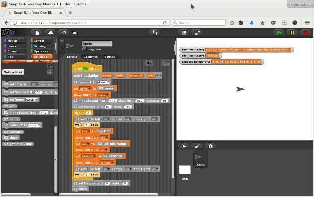
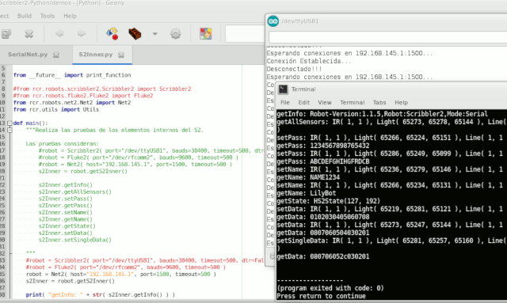
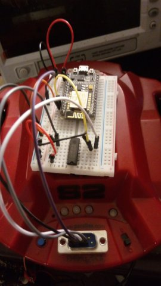

Scribbler2-Python
=================

Python (2.7/3.x) library to control the IPRE Scribbler2 robot ([www.parallax.com](https://www.parallax.com/product/28136)):
* Implements the IPRE Scribbler2's functionalities (MYRO Library)
* Implements the IPRE [Fluke2](http://www.betterbots.com/cshop/fluke2)'s functionalities
* Implements WIFI access to the Scribbler2 robot using a NodeMCU controller
* Add support for [Snap](https://snap.berkeley.edu/) (block programming languaje)

Notes about using the Fluke2 card:
* The Fluke2 card has a 3000 ms timeout, so you will need a proper timout in some operations
* You will need to stop ModemManager (Linux) because it blocks the access to the device

## Instalation
1. Install `pyserial`
2. Download the ZIP library file from [GitHub](https://github.com/titos-carrasco/Scribbler2-Python)
2. Run `pip install --user Scribbler2-Python-master.zip`

## Demos
See the `demos/` directory

## Development
* `Geany`
* `pydocstyle`
* `epydoc -v --html -o doc/ *.py rcr/`

