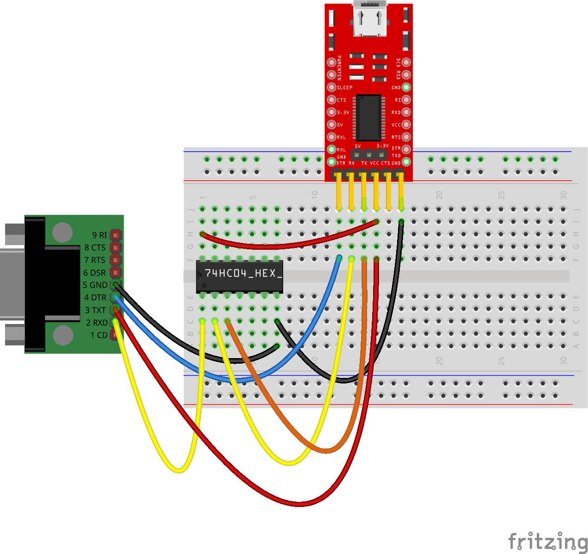

# Scribbler2-Python

Librería para controlar el robot Scribbler2  de Parallax:
- Implementa todas las funcionalidades de la librería MYRO del IPRE
- Implementa las funcionalidades de la tarjeta [Fluke2](http://www.betterbots.com/cshop/fluke2)
    - La tarjeta Fluke usa un timeout de 300ms por lo cual se deberá utilizar un timeout apropiado en algunos métodos
    - En Linux, ModemManager bloquea el acceso bluetooth a la tarjeta Fluke por lo cual debe ser desactivado
- En el conector DB9 (hembra) del robot:
    - El S2 opera con lógica invertida
    - El S2 coloca 9V en el pin 7 (CTS) lo que puede destruir un conector USB a RS232 que opere con niveles TTL
    - El S2 acepta voltajes de entrada entre -12v (V-) y 12v (V+)
    - El voltaje presente en el pin 5 (DTR) se utiliza como V-
    - El pasar de V+ a V- en DTR ocasiona que el S2 se resetee
    - En el pin 2 (TXD) el S2 coloca 3.3V como V+ al transmitir
    - En el pin 3 (RXD) el S2 convierte V+ a 3.3v al recibir

## Instalación
1. Requiere el paquete pyserial (`pyserial`)
2. Descargue el último release desde [GitHub](https://github.com/titos-carrasco/Scribbler2-Python)
2. Instale el wheel con `pip install scribbler2-x.y.z-py3-none-any.whl`

## Desarrollo
- Utilizar venv
- La librería se puede instalar para desarrollo con `pip install -e .`
- La documentación se genera con `pdoc -o docs/ scribbler2`
- El wheel debe ser generado con `python setup.py bdist_wheel`

## Conexión
- Con conversor USB a RS232 niveles TTL no manipular DTR

